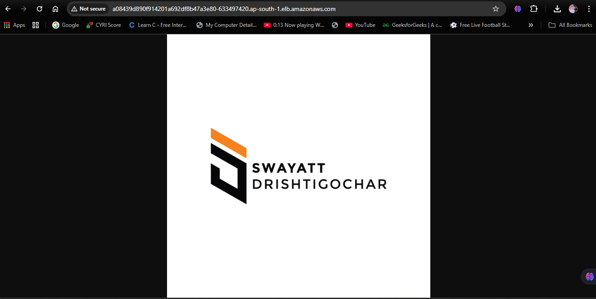
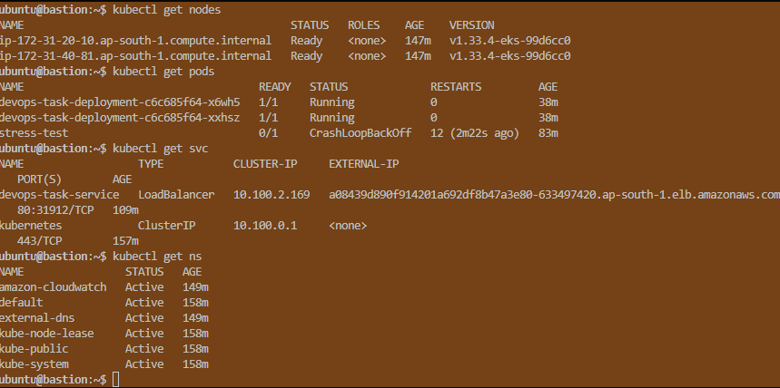
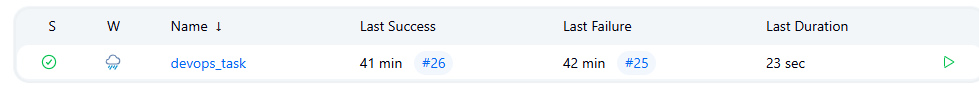
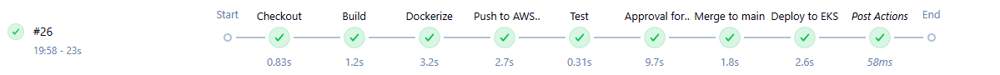
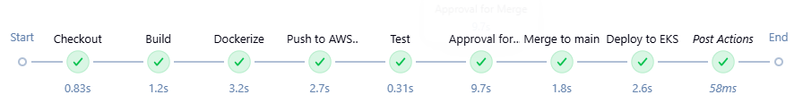

DevOps Task — CI/CD Pipeline on AWS with Jenkins & EKS
Objective

The objective of this project is to set up a complete CI/CD pipeline for a sample Node.js application using GitHub (source control), Jenkins (automation server), and AWS (cloud infrastructure).

The pipeline demonstrates:

End-to-end automation (build → test → containerize → push → deploy)

Deployment to Kubernetes (EKS)

Monitoring & observability using AWS CloudWatch Container Insights

DevOps best practices such as branching strategy, approvals, and IaC (Terraform scaffolding)

 Architecture

Flow Explanation:

Developer pushes code to GitHub (dev branch).

Jenkins job is triggered via webhook.

Pipeline stages:

Build: Install Node.js dependencies & run tests.

Dockerize: Build Docker image from Dockerfile.

Push to ECR: Push tagged image to AWS Elastic Container Registry (ECR).

Approval: Manual checkpoint before production merge.

Merge: If approved, automatically merge dev → main.

Deploy to EKS: Update Kubernetes Deployment with new Docker image.

Application runs on Amazon EKS cluster.

CloudWatch Container Insights provides monitoring & logging.

📂 Repository Structure
.
                    
├── infra/                   # Terraform scaffolding for infra (EKS, ECR, IAM, etc.)
│   ├── main.tf
│   ├── variables.tf
│   └── outputs.tf
├── deployment-proof/        # Screenshots & evidence of deployment
│   ├── jenkins-build.png
│   ├── ecr-repo.png
│   ├── eks-service.png
│   ├── cloudwatch-metrics.png
│   └── external_url.txt
├── Dockerfile               # Containerization definition
├── Jenkinsfile              # CI/CD pipeline definition
├── deployment.yaml          # K8s Deployment + Service manifests
|__stress-pod.yaml     #for testing
|___service.yaml
── README.md                # Project documentation (this file)
└── WRITEUP.md               # Detailed write-up (tools, challenges, improvements)

# Setup Instructions
1. Prerequisites

AWS account with:

EKS cluster + node group

ECR repository

IAM credentials with ECR, EKS, CloudWatch permissions

Jenkins installed (on EC2 or VM) with:

Docker & AWS CLI installed

kubectl installed & configured

GitHub repository forked & webhook configured

2. Infrastructure Setup (AWS)
 Manual method

Create an EKS cluster (Devops_tas-clusterk) via AWS Console or CLI.

Create an ECR repository (devops-task).

Configure IAM roles & attach policies for Jenkins node.

used method  Terraform (infra/)
cd infra/
terraform init
terraform apply -auto-approve

3. Jenkins Setup

Install plugins:

GitHub

Pipeline

AWS Credentials

Docker Pipeline

Add credentials in Jenkins:

aws-cred → AWS Access Key & Secret

git-cred → GitHub username & PAT

Configure a pipeline job with Jenkinsfile.

Ensure GitHub webhook is set up:

Repo → Settings → Webhooks → Point to http://15.207.33.3:8080/github-webhook/

4. Application Deployment

On code push to dev, Jenkins pipeline runs.

After tests, Docker image is pushed to ECR with tags:

:latest

:<BUILD_NUMBER>

Upon approval, branch dev is merged into main.

Jenkins updates EKS deployment with:

kubectl set image deployment/devops-task-deployment \
  devops-task=<ECR_REPO_URI>:<BUILD_NUMBER>

Service exposes app via AWS LoadBalancer.

Public endpoint available at:
 http://a08439d890f914201a692df8b47a3e80-633497420.ap-south-1.elb.amazonaws.com/ (stored in deployment-proof/external_url.txt)

5. Monitoring & Logging

CloudWatch Container Insights enabled for cluster.

Metrics available: CPU, memory, pod health, node health.

Stress test performed using:

kubectl run stress --image=progrium/stress -- \
  --cpu 2 --timeout 30s

Metrics confirmed in CloudWatch dashboard.

 Pipeline Flow (Jenkinsfile Summary)

Checkout → Pulls code from dev.

Build → Installs Node.js dependencies & runs tests.

Dockerize → Builds Docker image using Dockerfile.

Push to ECR → Pushes image with version tag & latest.

Test → Runs smoke/unit tests.

Approval → Requires human approval before merging.

Merge → Merges dev → main automatically.

Deploy to EKS → Updates running deployment with new image.

Post Actions → Success/failure notification.

 Deployment Proof

Located under /deployment-proof/:

 Jenkins pipeline successful run (jenkins-build.png)

 Docker image pushed to AWS ECR (ecr-repo.png)

 Application deployed on EKS (eks-service.png)

 Public endpoint proof (external_url.txt)

 CloudWatch metrics (cloudwatch-metrics.png)

 Tools & Services Used

Version Control: GitHub (branching: dev → main)

CI/CD: Jenkins (Pipeline-as-Code)

Containerization: Docker

Registry: AWS ECR

Orchestration: Amazon EKS (Kubernetes)

Monitoring: AWS CloudWatch Container Insights

IaC: Terraform (scaffolded)

 Challenges & Solutions

GitHub Auth Failure in Jenkins → Solved using GitHub PAT credentials injection.

ECR Push Permission Errors → Resolved by binding aws-cred in Jenkins with proper IAM policy.

EKS Rollout Sync Issues → Fixed by adding kubectl rollout status for deployment verification.

Metrics Visibility → Enabled metrics-server and CloudWatch Container Insights.